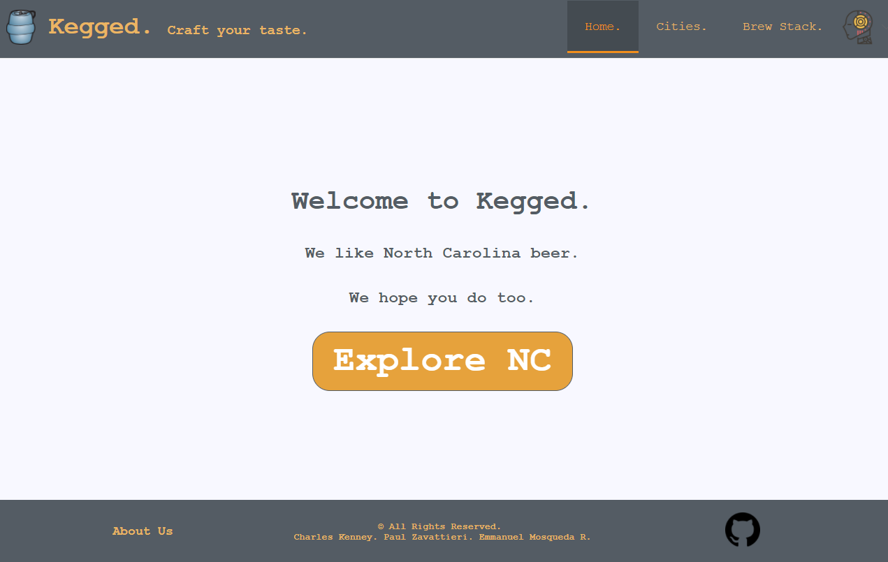

## Kegged.
A social beer app driven by user activity to discuss and discover breweries and brews in your local city.

Visit [Kegged](http://174.138.43.93/)!

## Motivation
It's tough deciding which brewery to go to on a given day. Breweries are always changing - the draft list changes, the setting changes, and maybe even management changes. Kegged is a one-stop app that allows locals to see cities, breweries, and beer lists and discuss them in an open forum with other users. With Kegged, you'll always know what to expect at a brewery on any given day.

## Code style
Vue.js, ES6
 
## Screenshot

## Tech/framework used
<b>Built with</b>
- [Vue.js](https://vuejs.org/)
- [Vuex](https://github.com/vuejs/vuex)
- [Nuxt](https://nuxtjs.org/)
- [Vue Stack Grid](https://www.npmjs.com/package/vue-stack-grid)
- [Element UI](http://element.eleme.io/#/en-US)
- [Firebase](https://console.firebase.google.com/?pli=1)
- [Axios](https://www.axios.com/)
- [JWT](https://jwt.io/)
- [bcrypt](https://www.npmjs.com/package/bcrypt)
- [Sequelize](http://docs.sequelizejs.com/)
- [Supertest](https://www.npmjs.com/package/supertest)
- [Mocha](https://mochajs.org/)
- [Chai](http://chaijs.com/)
- [Express.js](https://expressjs.com/)

## Features
- Vue.js with Element UI powers a fast, polished UI
- Login feature utilizing JWT and bcrypt for secure and simple logins
- Dynamic, real time updates to brewery pages when user content is added
- Our Brew Stack Grid to see all breweries in one location in a Pinterest-style waterfall
- User input validation while registering, logging in, and creating posts
- Custom [API](https://github.com/kegged/api)
- Brewery logos, brews, links to brewery websites
- User profile for easy viewing of past post/comment history

## Installation
Steps to clone repo to your local machine:

- Clone the repo to your preferred local directory
- Ensure that you have Node.js version 8.0 or later
- Ensure that you have [Yarn](https://yarnpkg.com/en/) installed
- Run the following in CLI to install all dependencies
    
    `yarn`

- Run the following in CLI to launch the app in development mode

    `yarn dev`

- Navigate to http://localhost:3000 in your browser

## API Reference
We created our own API for this project. The API can be visted at:

- [Github Repo](https://github.com/kegged/api)
- [Active API](https://kegged-api.herokuapp.com/)

## Credits
- [Udemy](https://www.udemy.com/)
- Inspiration drawn from Untappd, Reddit, and Pinterest

## License
MIT © [Charles Kenney](https://github.com/Charliekenney23), [Paul Zavattieri](https://github.com/paulz92), [Emmanuel Mosqueda R.](https://github.com/Emmamr)